# Skin Disease Detection AI

Интеллектуальная система классификации кожных поражений по дерматоскопическим изображениям с использованием глубокого обучения.

Проект включает полный ML-пайплайн: анализ данных, подготовку изображений, обучение нейросетевой модели, сравнение архитектур ResNet, оценку качества классификации, визуализацию Grad-CAM и интеграцию модели в Android-приложение.

---

## О проекте
В проекте реализованы:

* анализ набора данных ISIC 2019;
* предварительная обработка изображений;
* компенсация дисбаланса классов;
* обучение моделей ResNet18, ResNet34 и ResNet50;
* выбор итоговой архитектуры ResNet50;
* использование Focal Loss;
* оценка качества модели на тестовой выборке;
* построение ROC и Precision-Recall кривых для класса MEL;
* визуализация областей внимания модели методом Grad-CAM;
* Android-приложение для практического использования модели.

---

## Диагностические классы

В проекте используется 8 классов кожных заболеваний и состояний:

| Код  | Класс                                        |
| ---- | -------------------------------------------- |
| AK   | Актинический кератоз                         |
| BCC  | Базальноклеточная карцинома                  |
| BKL  | Доброкачественные кератозоподобные поражения |
| DF   | Дерматофиброма                               |
| MEL  | Меланома                                     |
| NV   | Меланоцитарный невус                         |
| SCC  | Плоскоклеточная карцинома                    |
| VASC | Сосудистые поражения                         |

---

## Используемый датасет

В качестве источника данных использован набор **ISIC 2019**, содержащий дерматоскопические изображения кожных поражений и разметку по диагностическим классам.

---

## Анализ данных

Одной из основных проблем датасета является выраженный дисбаланс классов. Наиболее многочисленным является класс `NV`, тогда как классы `DF` и `VASC` представлены значительно меньшим количеством изображений.

Это важно, потому что при обычном обучении модель может смещаться в сторону наиболее частых классов и хуже распознавать редкие, но клинически важные случаи.

  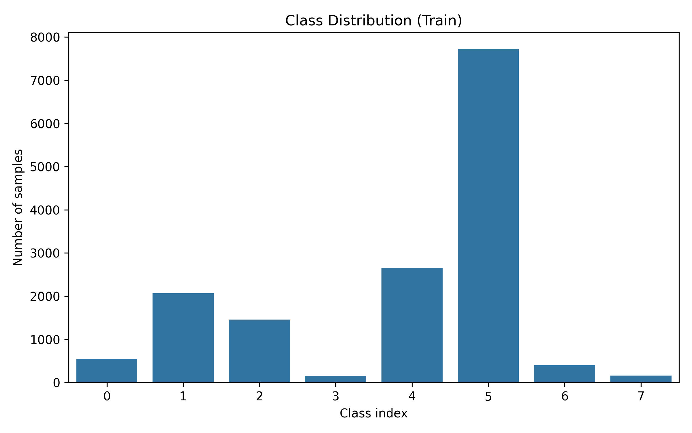

  <b>Распределение классов в обучающей выборке</b>

Также была построена корреляционная матрица классов. Отрицательные значения между классами объясняются тем, что каждое изображение относится только к одному диагностическому классу.

  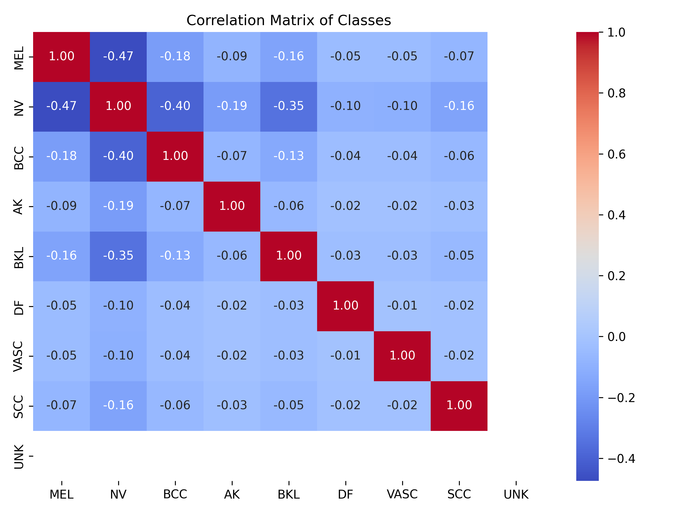

  <b>Корреляционная матрица классов</b>

Дополнительно анализировались размеры изображений. Поскольку исходные изображения имели разные размеры, все данные были приведены к единому входному формату.

  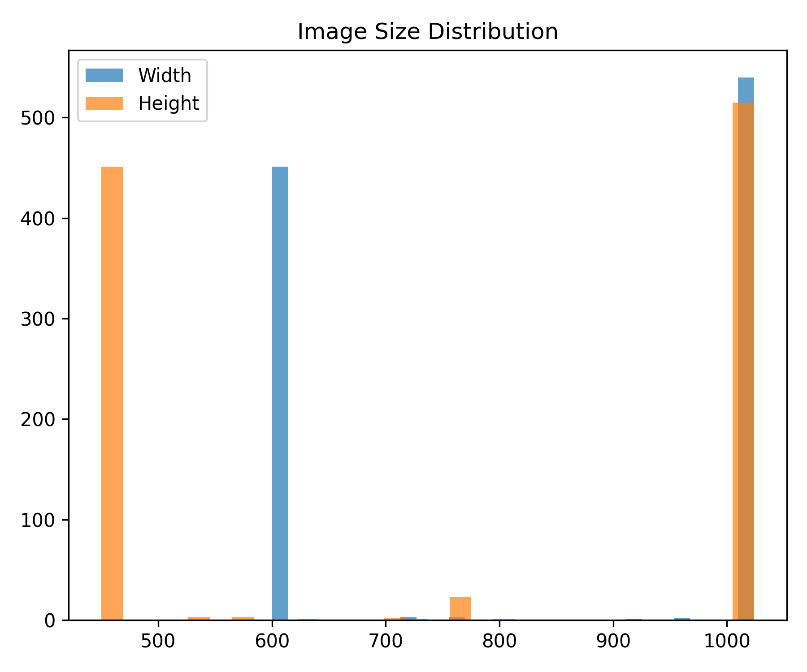

  <b>Распределение размеров изображений</b>

---

## Предобработка данных

Перед подачей изображений в модель выполнялась стандартная подготовка:

* изменение размера изображений до `224×224`;
* преобразование изображения в тензор;
* нормализация RGB-каналов;
* аугментация обучающей выборки;
* стратифицированное разделение данных;
* подготовка загрузчиков данных для PyTorch.

Использованные преобразования помогают сделать обучение устойчивее к различиям в масштабе, освещении, положении объекта и качестве изображения.

---

## Компенсация дисбаланса классов

Из-за сильного дисбаланса классов в проекте применялись два подхода:

1. **Веса классов**
   Редкие классы получают больший вес в функции ошибки, что усиливает их вклад при обучении.

2. **Focal Loss**
   Функция потерь делает больший акцент на сложных и ошибочно классифицируемых примерах.

---

## Архитектура модели

В проекте сравнивались архитектуры:

* ResNet18;
* ResNet34;
* ResNet50.

В качестве итоговой модели была выбрана **ResNet50**, так как она показала лучший баланс между качеством классификации и способностью извлекать сложные визуальные признаки.

Базовая классификационная часть ResNet50 была заменена на модифицированную MLP-голову, адаптированную под 8 классов.

---

## Обучение модели

В процессе обучения использовались:

* PyTorch;
* transfer learning;
* ResNet50;
* AdamW;
* Focal Loss;
* class weights;
* learning rate scheduler;
* train / validation / test split;
* контроль качества по метрикам классификации.

---

## Результаты обучения

В проекте сравнивались разные архитектуры ResNet. Графики обучения позволяют оценить изменение функции потерь и точности на обучающей и валидационной выборках.

  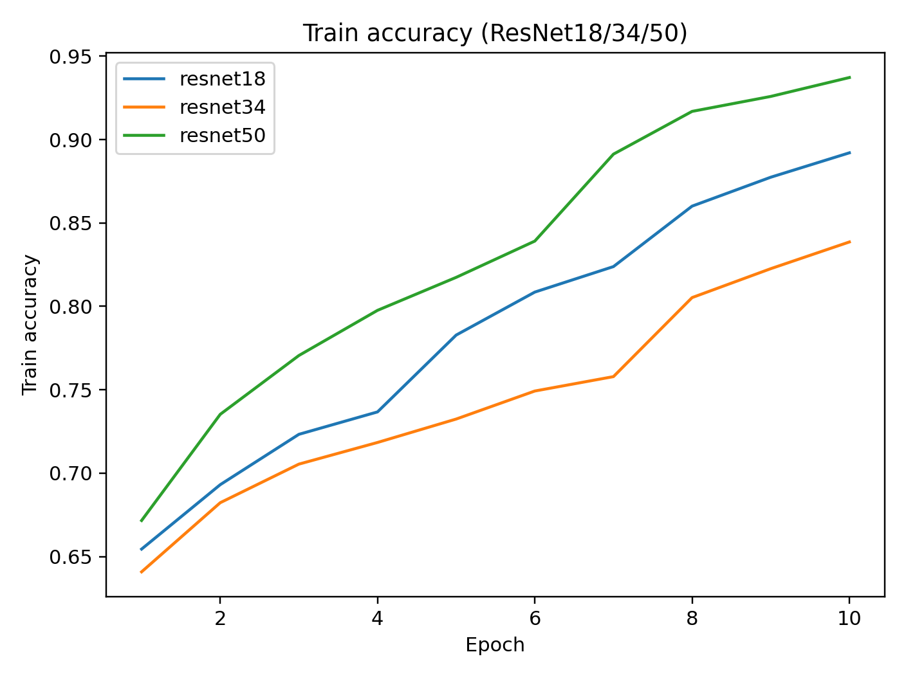

  <b>Точность на обучающей выборке</b>

  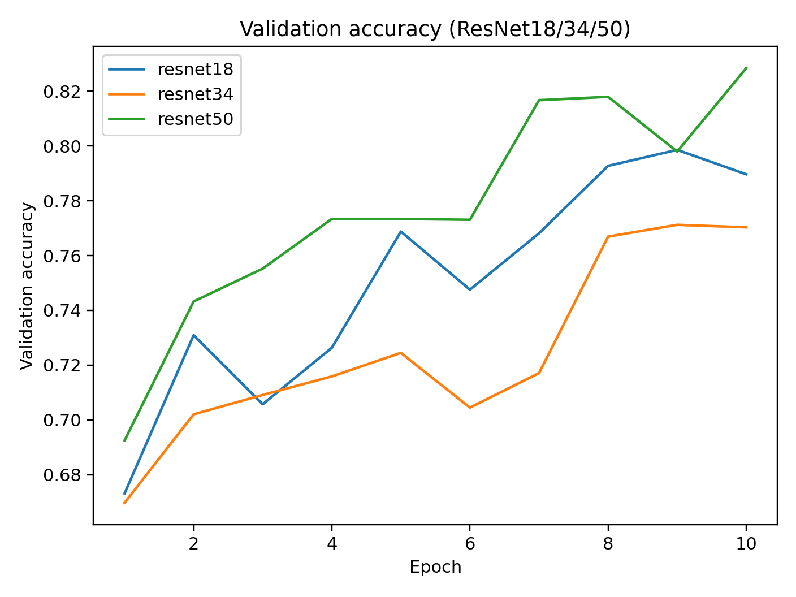

  <b>Точность на валидационной выборке</b>

  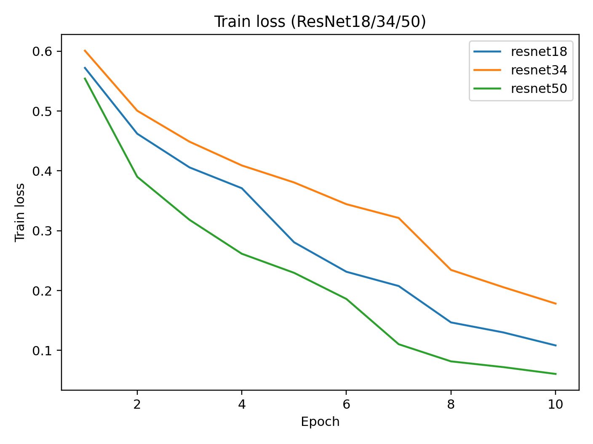

  <b>Функция потерь на обучающей выборке</b>

  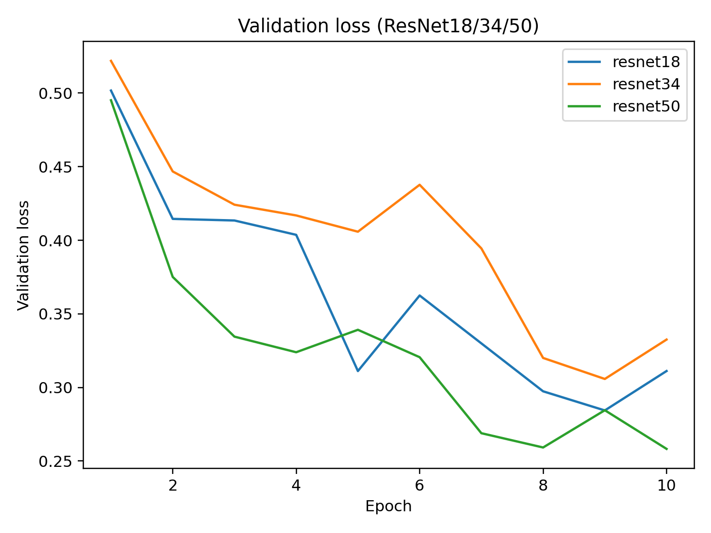

  <b>Функция потерь на валидационной выборке</b>

---

## Итоговые метрики

Итоговая модель ResNet50 показала следующие результаты на тестовой выборке:

| Метрика           | Значение |
| ----------------- | -------: |
| Accuracy          |   84.41% |
| Weighted F1-score |   0.8401 |
| Macro F1-score    |   0.7440 |
| MEL Precision     |   0.8238 |
| MEL Recall        |   0.6819 |
| MEL F1-score      |   0.7462 |
| MEL ROC AUC       |   0.9358 |

---

## ROC и Precision-Recall

Для класса `MEL` дополнительно были построены ROC и Precision-Recall кривые. Это важно, потому что меланома является наиболее клинически значимым классом в данной задаче.

  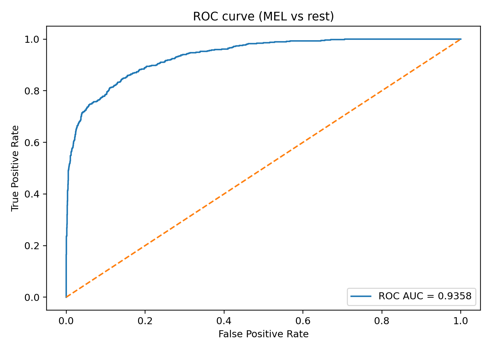

  <b>ROC-кривая для класса MEL</b>

  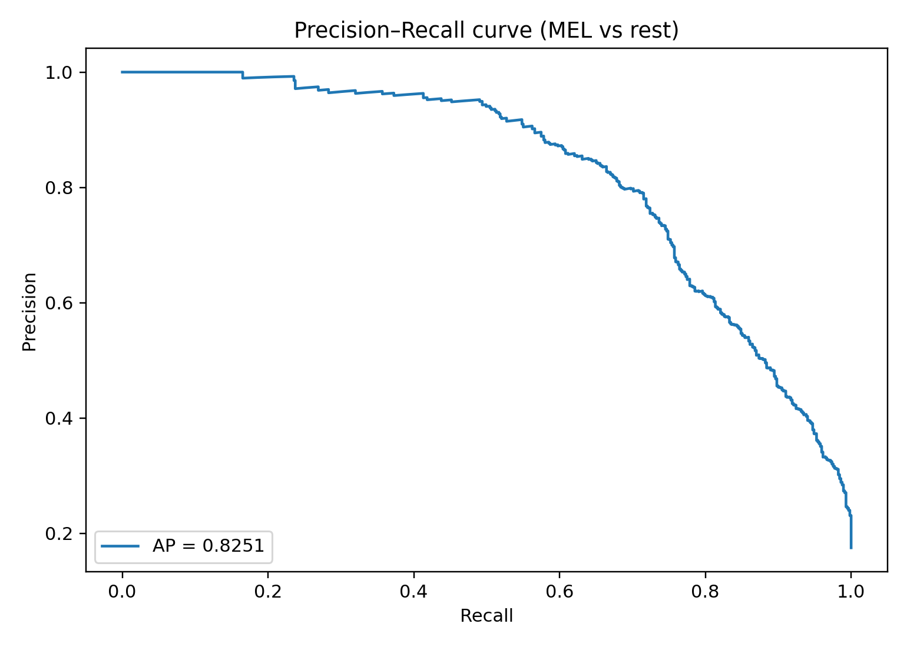

  <b>Precision-Recall кривая для класса MEL</b>

---

## Анализ уверенности модели

Для оценки распределения вероятностей предсказаний был построен график уверенности модели. Он позволяет понять, насколько часто модель выдаёт высокую или низкую уверенность при классификации.

  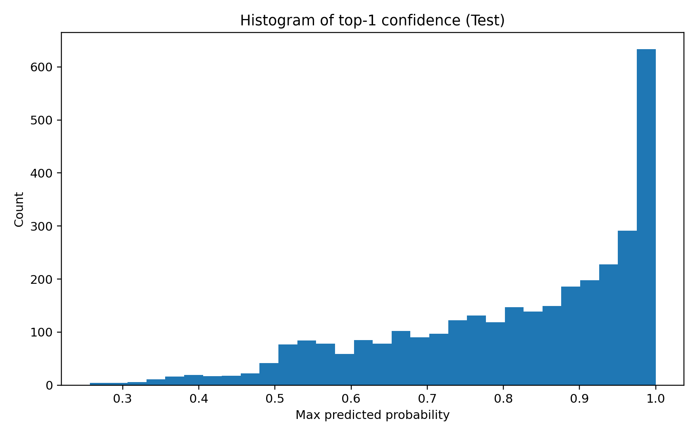

  <b>Распределение уверенности модели</b>

---

## Интерпретируемость: Grad-CAM

В медицинских задачах важно не только получить итоговый класс, но и понять, на какие области изображения модель опиралась при принятии решения.

Для этого в проекте реализован метод **Grad-CAM**. Он строит тепловую карту, показывающую области изображения, которые сильнее всего повлияли на итоговый прогноз модели.

  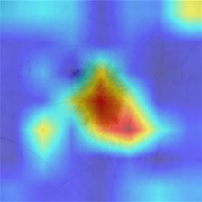

  <b>Пример визуализации Grad-CAM</b>

---

## Используемые технологии

### Machine Learning

* Python
* PyTorch
* TorchVision
* NumPy
* Pandas
* Scikit-learn

### Computer Vision

* OpenCV
* PIL
* Matplotlib
* Grad-CAM

### Архитектуры

* ResNet18
* ResNet34
* ResNet50

### Приложение

* Android Studio, Kotlin, JS
* PyTorch Lite
* GUI-прототип

### Инструменты

* Git
* PyCharm
* Jupyter Notebook
* Windows / Linux-ready structure

---

## Автор

**Алексей Молокин**
ML Engineer / Python Developer

GitHub: [molokinaleksej5](https://github.com/molokinaleksej5)
